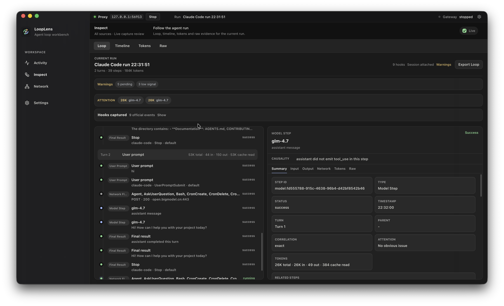

# LoopLens

[English](README.md)

Claude Code 与 Codex 运行过程的可视化调试器。

LoopLens 是一个本地桌面工作台，用来理解 Claude Code 或 Codex CLI 一次运行过程中到底发生了什么。它会通过全新的 capture 启动工具，在可用时记录结构化 hook 事件，读取 Claude session sidecar，捕获经过代理的网络流量，并把这些信息整理成可以检查的 loop 时间线。

它不是通用抓包器。LoopLens 专注于 Claude Code 和 Codex 调试：用户 prompt、模型轮次、工具调用、MCP 流量、skill 使用、token 压力、compact 事件、hook 生命周期事件，以及一次运行背后的网络证据。

> LoopLens 只用于本地调试你明确路由进来的流量。Capture 文件可能包含敏感 prompt、路径、响应和元数据。



[观看桌面演示](docs/assets/looplens-demo.mp4)

## 如何安装

从 [GitHub Releases](https://github.com/llm-101/LoopLens/releases/latest) 下载最新打包应用：

- **macOS Apple Silicon**：下载 `LoopLens_<version>_arm64.dmg`
- **macOS Intel**：下载 `LoopLens_<version>_x64.dmg`
- **Windows x64**：下载 `LoopLens_<version>_windows_x64.exe`

GitHub 自动生成的 **Source code (zip)** 和 **Source code (tar.gz)** 不是应用安装包。

当前 macOS 构建使用 ad-hoc 签名，暂未 notarize。macOS 或 Windows 首次启动时可能显示安全警告；请只在确认应用来自 LoopLens release 页面时批准打开。

如果 macOS 提示 **"Apple cannot verify LoopLens is free of malware"**：

1. 在 Mac 上打开 **Apple 菜单 -> System Settings**，然后在侧边栏点击 **Privacy & Security**。可能需要向下滚动。
2. 找到 **Security** 区域，然后点击 **Open**。
3. 点击 **Open Anyway**。
4. **Open Anyway** 按钮通常会在你尝试打开应用后一小时内显示。
5. 输入登录密码，然后点击 **OK**。

也可以在 Finder 里按住 Control 点击 `LoopLens.app`，选择 **Open**，再确认打开。

如果 macOS 提示 **"LoopLens is damaged and can't be opened"**，请把应用复制到 Applications，然后移除 quarantine 标记：

```bash
xattr -dr com.apple.quarantine /Applications/LoopLens.app
open /Applications/LoopLens.app
```

这个 workaround 只针对当前未 notarize 的预览构建。未来使用 Developer ID 签名并 notarize 的版本应当可以正常打开。

## 亮点

- 一键 **Open Claude Code** 和 **Open Codex**，每次都会创建一个按来源区分的新 run 文件。
- 结合 Claude session sidecar 与官方 HTTP hook 事件重建 Claude Code loop。
- 通过本地代理和 command-hook bridge 捕获 Codex run。
- 按 turn 查看 Inspect 视图：prompt、模型步骤、工具调用、MCP 调用、skills、最终结果、token 使用和 warning。
- Network Inspector 可查看运行期间产生的请求、响应、streaming chunks、headers、raw payload 和 token evidence。
- 为 Claude Code / Codex HTTPS 代理提供本地 CA 流程。
- 展示 capture 前会对常见含密钥 header 和 JSON 字段做保守脱敏。

## LoopLens 展示什么

对于 **Claude Code**，LoopLens 可以结合：

- `.claude` session JSONL sidecar
- 官方 Claude Code HTTP hook 事件
- 经过代理的 model/tool/MCP 网络流量
- 可用时的 token usage 和 compact 相关元数据

对于 **Codex**，LoopLens 可以结合：

- 全新的 `capture-codex-*.jsonl` run 文件
- 通过 `bin/looplens-hook` 路由的 command-hook 事件
- 经过代理的 OpenAI/API 流量和 streaming chunks
- 从捕获 payload 中提取的 token 和网络证据

## 架构

```text
Claude Code / Codex CLI
        |
        | fresh launch wrapper + HTTPS proxy + hooks
        v
looplens-proxy  ->  captures/capture-claude-code-*.jsonl
                 ->  captures/capture-codex-*.jsonl
                 ->  hooks/hook-events.jsonl
        |
        v
LoopLens Desktop  ->  Activity / Inspect / Network
```

Native proxy 会写入 JSONL capture 文件。桌面应用会读取这些 capture，在可用时读取 Claude session sidecar，读取 LoopLens hook 事件，并在 UI 中构建统一的 Claude Code / Codex run model。

## 仓库结构

```text
.
├── bin/                    # 本地 helper 脚本和 CLI 启动 wrapper
├── crates/looplens-proxy/  # Rust capture proxy 和本地 API gateway
├── desktop/                # Tauri + React 桌面应用
├── docs/                   # 截图和项目文档
└── .github/workflows/      # CI 检查
```

运行时状态会刻意排除在 git 之外：

- `ca/` 生成的本地 CA 材料
- `captures/` JSONL 流量 capture
- `hooks/` 本地记录的结构化 hook 事件
- `release/` 打包产物
- `.claude/` 和 `.codex/` 开发时使用的项目本地 hook 配置

贡献者可以查看 [docs/PROJECT_STRUCTURE.md](docs/PROJECT_STRUCTURE.md) 了解仓库地图。

## 环境要求

- 已安装 Claude Code 和/或 Codex CLI。
- 打包版本：macOS 或 Windows。
- 源码构建：Rust stable toolchain 和 Node.js 22 或更高版本。
- 当前内置 CA trust helper 脚本需要 macOS。

## 从源码构建

构建 native proxy：

```bash
cd looplens
./bin/gen-ca.sh
cargo build -p looplens-proxy --release
```

在 macOS 上信任本地 CA：

```bash
./bin/trust-ca-macos.sh
```

构建并打开桌面应用：

```bash
cd desktop
npm install
npm run build
open "src-tauri/target/release/bundle/macos/LoopLens.app"
```

在应用内使用 **Open Claude Code** 或 **Open Codex**。LoopLens 会创建新的 run，按需启动代理，通过本地 wrapper 启动对应 CLI，并自动跟随最新 loop。

### 首次启动清单

第一次打开打包应用时：

1. **Activity** tab 顶部会显示一个简短设置清单：先启用 **Hooks**，再通过 **Open Claude Code** 或 **Open Codex** 启动一次新的 run。
2. 在启动的工具里发送一个 prompt，然后进入 **Inspect -> Loop** 查看重建后的 run。
3. 只有当你需要完整 request/response 网络证据时，再使用 **Settings -> Trust** 和 HTTPS 代理。

这个清单可以随时隐藏。开发时如需重新显示，清理 webview localStorage 中的 `looplens.firstRunGuide.dismissed` 即可。

## 直接运行代理

```bash
./target/release/looplens-proxy run
```

Capture 文件会写入按来源区分的文件，例如 `captures/capture-claude-code-*.jsonl`、`captures/capture-codex-*.jsonl` 和 `captures/capture-gateway-*.jsonl`。

常用环境变量：

```bash
CCC_LISTEN=127.0.0.1:8899
CCC_OUTPUT_DIR=captures
CCC_CA_CERT=ca/looplens-ca.pem
CCC_CA_KEY=ca/looplens-ca.key
CCC_BODY_LIMIT=0
CCC_CAPTURE_ALL=true
```

## CLI Wrappers

通过 LoopLens 代理运行 Claude Code：

```bash
./bin/run-claude
```

通过 LoopLens 代理运行 Codex：

```bash
./bin/run-codex
```

当你点击 **Open Claude Code** 或 **Open Codex** 时，桌面应用会使用这些 wrappers。

## 从 CLI 检查 Captures

```bash
./target/release/looplens-proxy summary captures/capture-YYYYMMDD-HHMMSS.jsonl
```

也提供一个简单 HTML viewer：

```bash
./target/release/looplens-proxy serve --listen 127.0.0.1:8877 --captures-dir captures
```

然后打开 `http://127.0.0.1:8877`。

## 开发

前端和 Tauri shell：

```bash
cd desktop
npm install
npm run dev
```

CI 使用的检查：

```bash
cargo build -p looplens-proxy --release
cd desktop
npm run build:vite
cargo check --manifest-path src-tauri/Cargo.toml
npm run build
```

## 自动发布

推送版本 tag 时，GitHub Actions 会构建 release 包：

```bash
git tag v0.1.1
git push origin v0.1.1
```

Release workflow 会从 `desktop/` 构建 macOS arm64/x64 `.dmg` 包和 Windows x64 `.exe` 安装器，上传 assets，并根据 `desktop/src-tauri/tauri.conf.json` 中的 app version 创建 draft GitHub Release。

也可以从 **Actions -> Release -> Run workflow** 手动触发。

当前 macOS release 构建使用 ad-hoc 签名，暂未 notarize。macOS 和 Windows 首次启动时可能需要手动批准。

## 安全与隐私

LoopLens 会捕获你路由进来的本地 Claude Code / Codex 流量。即使有脱敏，JSONL capture 也可能包含敏感 prompt、工具输入、文件路径、模型响应、headers 和元数据。

不要提交或发布：

- `ca/`
- `captures/`
- `hooks/`
- `.claude/`
- `.codex/`
- `*.jsonl`
- `*.pem`
- `*.key`
- `*.log`

使用完后可移除本地 CA trust：

```bash
./bin/untrust-ca-macos.sh
```

更多细节见 [SECURITY.md](SECURITY.md)。

## Roadmap

- 更忠实地通过 `parentUuid` 链重建 Claude Code transcript。
- 更好的 Codex hook/session 关联。
- HAR/export 工作流。
- 签名并 notarize 的 macOS release。
- 按 provider 归因 token/cost。
- 带显式安全控制的 replay 和 diff 工具。

## License

Apache-2.0。见 [LICENSE](LICENSE)。
